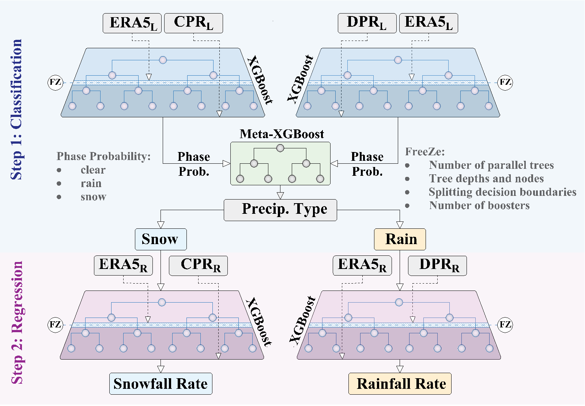

[](https://colab.research.google.com/github/Buddha-subedi/Microwave_Precipitation_Retrievals_from_B-RAINS/blob/main/main_notebook_BRAINS.ipynb)
# Boosted Transfer Learning for Passive Microwave Precipitation Retrievals

This repository represents the development of an algorithm, called the Boosted tRansfer-leArning for PMW precipitatioN Retrievals(B-RAINS). The algorithm relies on integrating the information content from Earth System Models (ESMs)
into the retrieval process and allows the fusion of multi-satellite observations across varying spatial and temporal resolutions through meta-model learning. The algorithm first detects the precipitation phase and then estimates its rate,
while conditioning the results to some atmospheric and surface-type variables.

<div style="display: flex; justify-content: center;">
  
</div>


<p align="center"><em>Boosted tRansfer-leArning for precIpitatioN RetrievalS (B-RAINS) presents an ensemble learning architecture that stacks parallel XGBoost base learners and combines their inference through a meta-model. Step 1 detects the precipitation occurrence and phase, and Step 2 estimates the rain and snow rate, with the subscripts ``L'' and ``R'' denoting labels and rates of the data sets. The retrievals transfer the learning from ERA5 to satellite through incremental training of the base learners in both steps. After learning ERA5, the number of parallel trees, tree booster numbers, depths, and splitting nodes are frozen (FZ) for the top part of the decision trees.</em></p>

<a name="4"></a> <br>
## Code

<a name="41"></a> <br>
###   Setup

```python
import numpy as np
import pandas as pd
from pathlib import Path
import xgboost as xgb
import scipy.io
import pmw_utils
import importlib
import matplotlib.pyplot as plt
from sklearn.model_selection import train_test_split
import scipy.stats as stats
from scipy.interpolate import interp1d
importlib.reload(pmw_utils)
from pmw_utils import plot_confusion_matrix, BRAINS_model
```
<a name="42"></a> <br>
 ### Load the Data
 
```python
# Load the training data

paths = {
    'cpr': Path.cwd() / 'data' / 'df_cpr_phase.npz',
    'dpr': Path.cwd() / 'data' / 'df_dpr_phase.npz',
    'era5': Path.cwd() / 'data' / 'df_era5_phase.npz'
}

data = {k: np.load(p) for k, p in paths.items()}
df_cpr_phase, df_dpr_phase, df_era5_phase = (pd.DataFrame({k: v[k] for k in v.files}) for v in data.values())

for name, df, sep in zip(
    ['ERA5 Samples for Classification', 'CPR Samples for Classification', 'DPR Samples for CLassification'],
    [df_era5_phase, df_cpr_phase, df_dpr_phase],
    ['##############################', '##############################', '']
):
    counts = df['Prcp flag'].value_counts().sort_index()
    print(f"**{name}**\nTotal samples for classification: {len(df)}")
    print(f"Clear: {counts.get(0,0)}, Rain: {counts.get(1,0)}, Snow: {counts.get(2,0)}")
    if sep: print(sep)
```
    **ERA5 Samples for Classification**
    Total samples for classification: 7000000
    Clear: 3500000, Rain: 2500000, Snow: 1000000
    ##############################
    **CPR Samples for Classification**
    Total samples for classification: 240800
    Clear: 120400, Rain: 86000, Snow: 34400
    ##############################
    **DPR Samples for Classification**
    Total samples for classification: 2800000
    Clear: 1400000, Rain: 1000000, Snow: 400000


<a name="43"></a> <br>
 ### Train the B-RAINS Model
B-RAINS Model has 4 base learners. The hyperparameters and snip of code adopted for stage 1 and stage 2 for the ERA5-CPR phase detection is provided below

```python
#stage 1
params = {
    'objective': 'multi:softmax',
    'num_class': 3,
    'eval_metric': 'merror',
    'reg_alpha': 0.095,
    'reg_lambda': 7.843,
    'max_depth': 18,
    'num_parallel_tree': 3,
    'learning_rate': 0.330808,
    'gamma': 0.661776,
    'verbosity': 0
}

booster_era5 = xgb.train(
    params=params,
    dtrain=dtrain,
    evals=evals,
    num_boost_round=93,
    verbose_eval=True
)
#stage 2
classes = np.unique(df_70_train_cpr['Prcp flag'])                         
class_weights = {0: 1, 1: 1.167, 2: 1.766}
sample_weights_70 = df_70_train_cpr['Prcp flag'].map(lambda x: class_weights[classes.tolist().index(x)])
# Set parameters
params = {
    'objective': 'multi:softmax',
    'num_class': 3,
    'eval_metric': 'merror',
    'subsample': 0.5,
    'reg_alpha': 6.948,
    'reg_lambda': 5.0278,
    'max_depth': 18,
    'num_parallel_tree': 6,
    'learning_rate': 0.018,
    'gamma': 0.32,
    'verbosity': 0
}

# Train with the new data (booster here is the final model that is first trained on coarse
# resolution information from ERA5 and then finetuned on fine resolution satellite information)
booster = xgb.train(
    params,
    dtrain_cpr,
    num_boost_round=182,
    evals=evals,
    xgb_model=booster_era5,
    verbose_eval=True,
    feval=f1_eval_all_classes
)
```


<a name="44"></a> <br>
 ### Load the B-RAINS model
```python
model_dir = r'G:\Shared drives\SAFL Ebtehaj Group\Buddha Research\Research 1\model'

era5_dpr_base_learner = xgb.XGBClassifier()
era5_dpr_base_learner.load_model(os.path.join(model_dir, 'classifier_incremental_dpr_optuna_maximize_min_f1.json'))

era5_cpr_base_learner = xgb.XGBClassifier()
era5_cpr_base_learner.load_model(os.path.join(model_dir, 'classifier_incremental_cpr_optuna_maximize_min_f1.json'))

meta_model = xgb.XGBClassifier()
meta_model.load_model(os.path.join(model_dir, 'incremental_meta_both_point_zero_one.json'))

snow_rate_booster_tl = xgb.Booster()
snow_rate_booster_tl.load_model(os.path.join(model_dir, 'xgb_tl_snow_rate.json'))

rain_rate_booster_tl = xgb.Booster()
rain_rate_booster_tl.load_model(os.path.join(model_dir, 'xgb_tl_rain_rate.json'))
```

## Dataset
The dataset for training the networks and retrieving sample orbits is available [here](https://drive.google.com/drive/u/0/folders/1Njpyd_nWbNwxumzqJXwW5GhjkMftDVzW).
